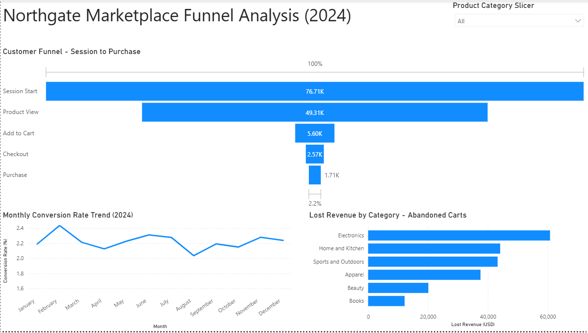

# Cart Abandonment and Revenue Recovery Analysis — Northgate Marketplace

## Executive Summary

Northgate Marketplace achieved an overall session-to-purchase 
conversion rate of 2.22% in 2024, while cart abandonment resulted 
in $217,956 in lost revenue — 1.82 times the $119,555 in revenue 
successfully captured — with 65% of all sessions originating from 
mobile devices. After identifying that the largest source of 
revenue loss stems from cart abandonment in the Electronics 
category, recommended interventions include targeted cart 
recovery tools, abandoned cart email reminders, and a mobile 
checkout experience redesign, projected to generate between 
$2,982 and $9,048 in additional annual revenue.

---

## Business Problem

Completed orders and a seamless customer experience are paramount 
to the success of Northgate Marketplace. Despite maintaining an 
overall conversion rate of 2.22%, lost revenue exceeds captured 
revenue by a factor of 1.82x, representing a significant and 
addressable gap in funnel performance. Sales stakeholders requested 
an investigation into this discrepancy, structured around four core 
questions:

1. What is the overall funnel conversion rate, and where does the 
most significant revenue loss occur within the purchase funnel?

2. Which product categories experience the highest cart 
abandonment, by both rate and dollar value?

3. Are there monthly trends in conversion performance across 2024 
worth accounting for?

4. Does device type influence cart abandonment behavior, and if 
so, which segment warrants priority intervention?

---

## Dashboard



---

## Methodology

1. **Data Generation (Python)** — Generated a synthetic 
transactional dataset simulating 76,709 customer sessions across 
2024, including products, sessions, events, and orders across a 
four-table relational schema.

2. **SQL Analysis (SQLite)** — Wrote SQL queries to analyze funnel 
conversion rates, cart abandonment by category and device type, 
monthly conversion trends, and revenue impact of funnel drop-off.

3. **Dashboard (Power BI)** — Built an interactive dashboard to 
visualize funnel performance, lost revenue by category, and 
monthly conversion trends with category filtering, enabling sales 
stakeholders to independently access and filter funnel metrics by 
product category.

4. **Revenue Recovery Simulation (Python)** — Created a simulation 
modeling the financial impact of reducing Electronics cart 
abandonment by 5%, 10%, and 15%.

---

## Skills

**SQL:** Relational database design, CTEs, window functions, 
anti-join pattern, funnel aggregation queries

**Power BI:** Data modeling with relationships, DAX measures, 
funnel chart, interactive slicer, dashboard design

**Python:** Synthetic data generation with realistic e-commerce 
benchmarks, revenue recovery simulation modeling

---

## Results

**The primary funnel leak occurs at the product view to add-to-cart 
stage.** An 88.63% drop-off rate at this stage represents the 
single largest source of friction in the purchase funnel, ahead of 
any later-stage abandonment point.

**Electronics drives the largest share of lost revenue.** The 
category accounts for 27.88% of total lost revenue at $60,764 
annually, driven by high per-cart values averaging $102.82 — 
making it the highest-value abandonment segment in the dataset. 
Home and Kitchen and Sports and Outdoors are secondary categories 
of concern.

**Mobile users abandon carts at consistently higher rates than 
desktop users.** This pattern holds across all product categories, 
making mobile checkout optimization a priority intervention 
alongside category-specific fixes.

---

## Business Recommendation

The revenue recovery model projects that reducing Electronics cart 
abandonment by 5% to 15% would generate between $2,982 and $9,048 
in additional annual revenue. The following recommendations are 
intended for the Product, Marketing, and Revenue Operations teams.

**Deploy cart recovery tools for active but abandoned sessions.** 
Real-time recovery prompts for customers with items still in cart 
but no completed purchase would address the highest-frequency 
abandonment scenario directly.

**Launch email and text reminders for abandoned carts.** Automated 
reminders targeting customers who abandon mid-funnel would 
re-engage the segment most likely to convert with minimal 
additional friction.

**Redesign the mobile checkout experience.** Mobile users show 
consistently higher abandonment than desktop across all 
categories; reducing checkout friction on mobile is the 
highest-leverage fix given that Electronics purchases — the 
highest-value abandonment segment — skew toward mobile sessions.

Prioritizing Electronics and mobile users targets the 
highest-value abandonment segment identified in the analysis.

---

## Next Steps

**A/B test the mobile checkout redesign.** Establish a controlled 
test comparing the redesigned mobile checkout experience against 
the current flow to validate the abandonment reduction before full 
rollout.

**Examine secondary categories for similar patterns.** Home and 
Kitchen and Sports and Outdoors showed elevated abandonment but 
were not the primary focus of this analysis; a category-specific 
investigation would determine whether the same interventions apply.

**Measure campaign effectiveness.** Track email and text reminder 
open and click-through rates to determine which channel and 
messaging combination most effectively recovers abandoned carts.

---

## Repository Structure

```bash
Northgate-Marketplace-Funnel-Analysis/
│
├── README.md                                        — This document
│
├── data/raw/
│   ├── products.csv                                 — Product catalog
│   ├── sessions.csv                                 — Customer session records
│   ├── events.csv                                   — Funnel event log (view, cart, purchase)
│   └── orders.csv                                   — Completed order records
│
├── python/
│   ├── Northgate_Data_Generation.ipynb              — Synthetic data generation notebook
│   └── Northgate_Analysis.ipynb                     — SQL validation and revenue recovery simulation notebook
│
├── sql/
│   ├── northgate_marketplace.db                     — SQLite database (Power BI connects via ODBC)
│   ├── 00_create_schema.sql                         — Relational schema definition
│   ├── 01_funnel_conversion.sql                     — Funnel conversion rate analysis
│   ├── 02_cart_abandonment.sql                      — Cart abandonment by category and device
│   ├── 03_monthly_conversion_trend.sql              — Monthly conversion trend analysis
│   └── 04_revenue_impact.sql                        — Revenue impact of funnel drop-off
│
├── dashboard/
│   ├── Northgate_Marketplace_Dashboard.pbix         — Interactive Power BI dashboard
│   └── dashboard_screenshot.png                     — Dashboard screenshot
│
└── insights/
    └── Northgate_Cart_Abandonment_Analysis.docx     — Full business narrative and recommendations
```

---

## How to Run

Requires Python with pandas and numpy, SQLite or related SQL programs for the SQL queries, and Power BI Desktop for the dashboard. All data files are in the data/raw folder.
